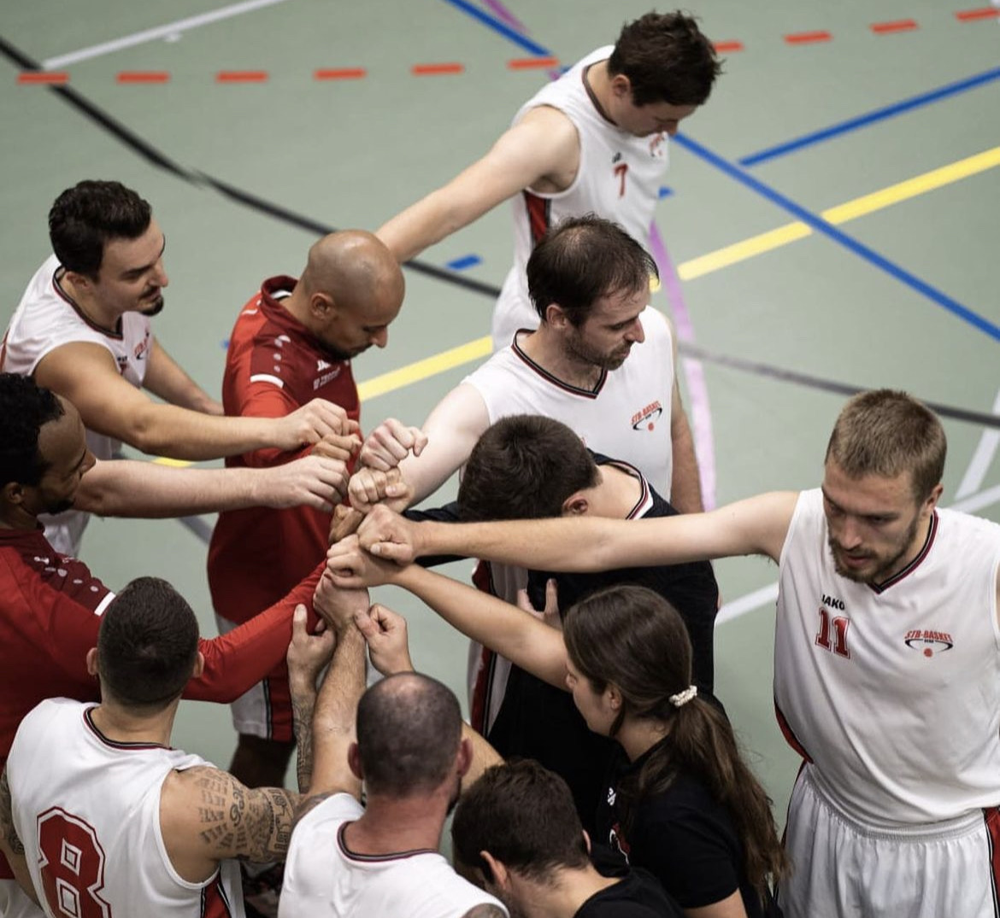
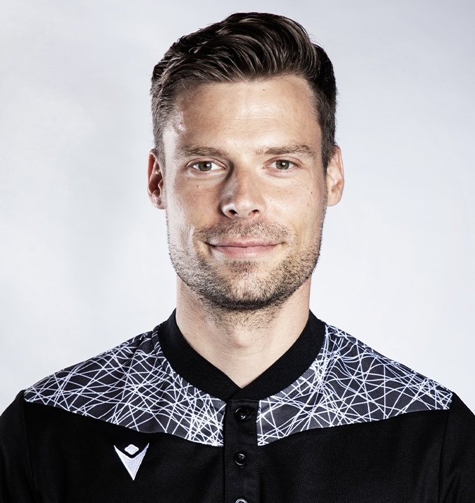
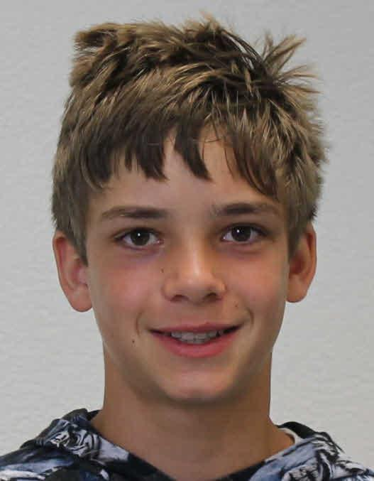

+++
title = "Die Psychologie im Bereich des Sports"
date = "2023-05-31"
draft = false
pinned = false
tags = ["Deutsch", "Reportage"]
image = "microsoftteams-image-5-.png"
+++
<!--StartFragment-->

**Die meisten von uns treiben gerne Sport, vor allem haben viele Jugendliche den Traum, irgendwann im Leben Profisportler zu werden.**  

**Dennoch schaffen es nur wenige, diesen Traum zu erreichen. Deshalb fragt man sich, wie man es schafft, ein Profi zu werden.**  

**Die Antwort ist recht simpel, aber diese umzusetzen ist nicht so einfach.**  

Von **Jesse Lu** und **Garid Amarjargal**

Was den meisten Sportlern auf dieser Welt fehlt, ist eine gute Mentalität und ein gutes Mindset.  

Wenn man einmal Berufssportler werden möchte, muss man die Psychologie im Bereich des Sports verstehen. Das wichtigste Prinzip der Sportpsychologie ist die Motivation und die Konsistenz für das Training.  

Wir erklären euch nun die Wichtigkeit der Motivation und der Konsistenz an. Wir beantworten diese Fragen mit Hilfe von Dr. Urs Schnyder, einem promovierten Sportwissenschaftler, der neben seiner Schiedsrichterkarriere als Sportlehrer am Gymnasium Kirchenfeld arbeitet.  

Die simpelste Strategie, im Bereich des Sports erfolgreich zu werden, ist es konsistent zu arbeiten. Damit meinen wir die Konsistenz der Trainings, die die Sportler regelmässig absolvieren müssen, um die körperliche Stärke zu erlangen. Das hört sich recht anspruchslos an, doch wieso schaffen es nur die wenigsten auf der Erde, einen Trainingsplan zu verfolgen, ohne irgendwann aufzugeben? Es gibt viele Gründe, wieso die Mehrheit aller Sportler es nicht schaffen, einen Trainingsplan lückenlos zu absolvieren.  

Doch der grösste Grund sind die Ablenkungen, die ein Teenager im Alltag erleiden muss.  

Sehen wir uns mal ein Beispiel an: Jeder kennt es, wenn wir am Morgen im Bett mit dem Handy in der Hand liegen und durchs Social Media scrollen. Jeder macht es und niemand weiss wieso. Durch bestimmte Apps wie z.B. TikTok, ist es heutzutage sehr einfach, Dopamin auszuschütten. Durch das Scroll System von TikTok erhält man eine sofortige Belohnung / Befriedigung, die man früher in einer viel grösseren Zeitspanne erlangt hätte. Da wir in einer modernen Umwelt leben und im Vergleich zu früher viel mehr Dopamin ausschütten, stieg unser Dopaminlevel sehr stark. Das führt dazu, dass es für die Mehrheit der Menschen heutzutage sehr schwer ist, nach draussen zu gehen oder ein Buch zu lesen. Der Grund dafür ist, dass das Nach-Draussen-Gehen oder ein Buch zu lesen, viel weniger Dopamin ausschüttet, als durch Social Media zu scrollen und wer würde schon etwas tun, was uns weniger gut fühlen lässt. Sobald man auf dem Bett liegt und durch TikTok scrollt, ist es sehr schwer wieder aufzuhören und an die Arbeit zu gehen. Dieses Gefühl nennt man die Prokrastination. Man schiebt die wichtige Arbeit auf später, damit man für jetzt weiter scrollen kann. Das Gleiche passiert auch, wenn man trainieren sollte.  

Nun stellt sich die Frage: Was sollte man jetzt dagegen tun? 

Ganz einfach, das Ziel ist nun unser Dopaminlevel wieder zu senken, damit uns die langweiligen Sachen im Alltag wieder Spass machen. Das tun wir, indem wir den Zugriff aufs Social Media limitieren und am besten sogar zu meditieren. Das Meditieren hilft uns, uns zu konzentrieren und unsere Fähigkeit zu verstärken und hilft auch, eine Klarheit im Kopf zu bilden.  

Wenn unser Kopf klar ist, ohne irgendwelche Ablenkungen, können wir dann klar denken und wissen dann auch, was wir in dem Moment für unsere Zukunft tun sollen.  

Natürlich gibt es auch Tage, an denen wir mal nicht trainieren möchten. Diese Tage haben alle schon einmal erlebt, auch Berufssportler. Doch der Unterschied zwischen einem Profisportler und einem normalen Sportler ist, dass ein durchschnittlicher Sportler von der Motivation angetrieben wird und ein Profisportler durch die Disziplin. Ich möchte diesen Abschnitt mit einem Zitat von Dwayne (The Rock) Johnson beenden: 

«The man who goes to the gym every single day regardless of how he feels will always beat the man who goes to the gym when he feels like going to the gym. » *\-Dwayne Johnson* 

Eine Frage, die sehr wichtig ist für einen Sportler: 

Wie kann man Sportpsychologie verbessern?  

Es gibt viele Möglichkeiten. Eindeutig der Wichtigste ist, dass man an sich selbst arbeiten und sich nur auf sich konzentrieren soll. Eine gute Technik für die Konzentrationsverbesserung ist die Atemtechnik. Sie kann helfen, Stress abzubauen. Es gibt verschiedene Athleten mit unterschiedlichen Atemtechniken und nicht alle Techniken sind für jeden geeignet, darum kann es hilfreich sein, verschiedene Atemtechniken auszuprobieren und herausfinden, welche genau am besten funktioniert. Auch etwas Wichtiges ist, eine Atemtechnik von einem professionellen Sportpsychologen anzuwenden.  

Vorstellung spielt eine grosse Rolle in der Mentalität. Man soll sich positive Sachen vorstellen. Zum Beispiel über ein realistisches und erreichbares Ziel denken und vorstellen, als ob man das Ziel erreicht hätte. Daraus wird man selbstsicher und motivierter. Ein weiterer Weg, wie man die Sportpsychologie verbessern kann und dabei auch den Intelligenzquotienten, ist durch das Schachspiel. Wenn man einen hohen Intelligenzquotienten hat, kann man den Gegner übertrumpfen und so den Sieg erreichen. Schach ist eine Denksportart, bei den mentalen Fähigkeiten wie Konzentration, Gedächtnis, strategisches Denken und Entscheidungsfindung eine wichtige Rolle spielen. Wenn man Schach spielt, lernt man vorauszudenken, um den nächsten Zug auszuüben, was vor allem im Teamsport sehr nützlich sein kann.  

Insgesamt gibt es also viele Möglichkeiten, die Sportpsychologie zu verbessern. Wichtig ist dabei vor allem, das Feedback von den umgebenen Leuten gut zuhören und auf die eigenen Bedürfnisse und Schwächen zu achten und gezielt an diesen zu arbeiten. Durch eine gute mentale Vorbereitung und Regeneration kann man seine Leistungsfähigkeit steigern und erfolgreicher im Sport sein. 

Über Interview Partner 

Ein Sportlehrer hat oft die Aufgabe, Sportler/-innen zu trainieren und zu motivieren, um ihre Leistungen zu verbessern. Dazu gehört auch das Verständnis der psychologischen Faktoren, die einen Einfluss auf die sportlichen Leistungen haben können. Daher haben wir uns entschieden, einen Sportlehrer oder Trainer zu diesem Thema zu interviewen, um ein besseres Verständnis dafür zu bekommen, wie psychologische Prinzipien angewendet werden können, um die Leistung zu verbessern. Außerdem können sie mögliche wertvolle Einblicke aus ihren eigenen Erfahrungen und ihrem Fachwissen teilen. Wir haben uns für Dr. Urs Schnyder entschieden, da er als Schiedsrichter mit professionellen Fußballspielern arbeitet und daher viele Erfahrungen zu diesem Thema hat. Das Interview mit ihm war sehr angenehm und seine Antworten waren sehr leidenschaftlich. Wir haben nicht nur viel über das Thema gelernt, sondern auch darüber, wie man bei Fragen vollständig und enthusiastisch antworten sollte. 

«Die Psychologie kann eine wichtige Rolle dabei spielen, Menschen zu helfen, ihr Leben in schwierigen Situationen zu meistern und ihre persönlichen Ziele zu erreichen. »  *\-Dr. Urs Schnyder* 

Als zweiter Interviewpartner wollten wir jemanden aus unserer Klasse wählen, der regelmäßig Sport treibt, um ein offenes Interview zu führen. Während wir nach einem geeigneten Kandidaten suchten, haben wir festgestellt, dass viele von uns regelmäßig trainieren. Schließlich haben wir uns für Leif Schuppli entschieden. Das Interview mit ihm war ebenfalls sehr angenehm und lustig, dauerte jedoch länger als das mit Dr. Urs Schnyder. Wir haben am Anfang des Interviews über die Sportarten (Fußball und Leichtathletik) gesprochen, die er trainiert, und dann die gleichen Fragen wie bei Dr. Urs Schnyder gestellt. Am Ende haben wir über das Gespräch mit Dr. Urs Schnyder diskutiert und Leifs Meinungen dazu gehört. Er hat uns erzählt, dass er und seine Mannschaft mehrmals an großen Turnieren teilgenommen haben, aber sie haben ihre Mentalität nie darauf vorbereitet. Wir denken, dass es eine gute Entscheidung war, Leif zu interviewen, und hoffen, dass er durch unsere Reportage etwas lernt und seine Mannschaftsmitglieder darüber informiert. 

«Ich glaube, dass für Jugendliche das Körpertraining viel wichtiger ist als das mentale Training» *\-Leif Schuppli* 

«Allzu viel ist ungesund» 

Ein Zitat aus dem Buch «Sportpsychologie für alle», veröffentlicht im Jahr 2001 von Paul Kunath, was vielen Aspekten im Thema Sports übereinstimmt. Das Zitat können wir im Zusammenhang mit dem Übertrainieren verstehen, denn zu wenig Training ist nicht so optimal, weil man da nicht vorwärtskommt und die Konkurrenz uns dann zurücklässt, aber zu viel Training ist auch nicht die beste Option, weil es sehr einfach zu einem Burnout kommen kann. Der Burnout würde uns sehr verhindern, da man für eine Zeitperiode kein Training absolvieren kann und deshalb so nicht vorwärtskommt. Wenn man übertrainiert, hat der Körper, besonders die Muskeln in unserem Körper, keine Zeit zu regenerieren und das führt dann dazu, dass die Muskeln nicht völlig erholt sind und man deshalb keine 100% geben kann. Weitere Symptome sind: Muskelschmerzen (Muskelkater), Müdigkeit und Schlafstörungen, depressive Stimmung und erhöhtes Verletzungsrisiko. 

Was soll man nun tun, wenn man die oben aufgezählten Symptome erkennt und den Verdacht hat, einen Burnout zu haben? 

1. Mehr schlafen: Es ist sehr wichtig, mehr und länger zu schlafen, wenn die Muskeln derzeit beschädigt sind. Die Muskeln regenerieren sich hauptsächlich, während wir schlafen, weil wir uns im Schlaf nicht bewegen und auch weil das Gehirn im Schlaf weniger aktiv ist, denn so kann mehr Blut in die Muskeln gepumpt werden.  
2. Gesunder ernähren: Während der Erholung ist es wichtig, sich gesund zu ernähren und dem Körper die benötigten Nährstoffe zu liefern, damit man so schnell wie möglich wieder fit ist. Man sollte am besten auf das Fast Food verzichten und darauf achten, genügend Eiweiss, Kohlenhydrate, Vitamine und gesunde Fette in ihrer Ernährung zu haben. 
3. Pause machen: Man sollte regelmässig Pausen nehmen und sich entspannen, damit sich die Erschöpfung und das Übertraining nicht wieder aufbaut.  
4. Professionelle Hilfe aufsuchen: Falls nach einem langen Zeitraum immer noch ein Burnout hat und man schon alles andere versucht hat, sollte man bestens so früh wie möglich zum Arzt gehen. Sie können helfen eine Routine zu entwickeln und sicherzustellen, dass man sich ausreichend erholt.  

<!--EndFragment-->